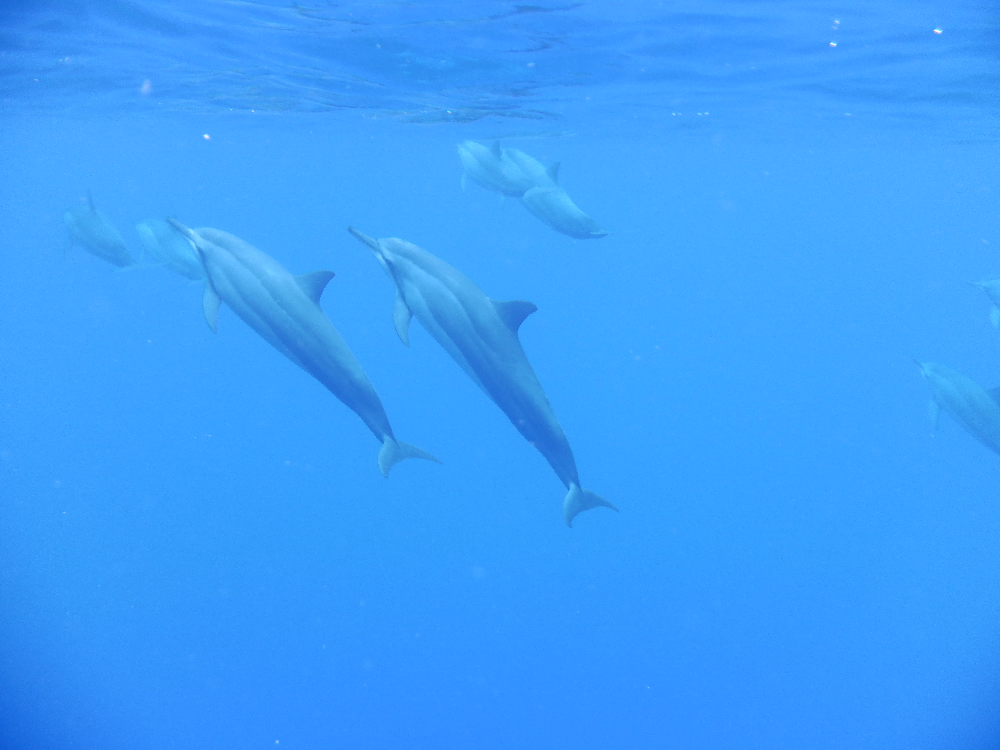

# CSE 110 Lab 1 Index Page

[Skip to requirements checklist!](#conclusion)

This is a webpage that describes **bold** and *exciting* that I have done.

A great quote that I have heard is this:
> A man is not old until his regrets take the place of his dreams.

And I think this quotes encapsulates what I hope to achieve in life a lot.

---
### Adventures

I've travelled a little bit in my life, whenever I have time between academic work.
Here's a few pictures from places that I've gone:

And here's a picture that I took from UCSD Rady!

---
### Academics

Academically speaking though, most of my focus has been spent on robotics and computer science.

In high school and university, I've been on two robotics teams: [AVBotz](https://www.avbotz.com/index.html) and [Triton Robosub](https://robosub.ucsd.edu/).

Otherwise, I've been exploring algorithms and languages at home. I know how to program well in:

1. C/C++
2. Python
3. Java

Other languages I can program in relatively well are:
- TLA+
- System Verilog
- HTML

For example, here is Hello World done in C++: 
`std::cout << "Hello World" << std::endl;`

---
### Conclusion

[Here is my README in this repo](README.md)

That wraps it up for this page, I have completed:
- [x] Pictures
- [x] Headings
- [x] Styling Text
- [x] Quoting Text
- [x] Quoting Code
- [x] External Links
- [x] Section Links
- [x] Relative Links
- [x] Ordered/Unordered Lists
- [x] Task List